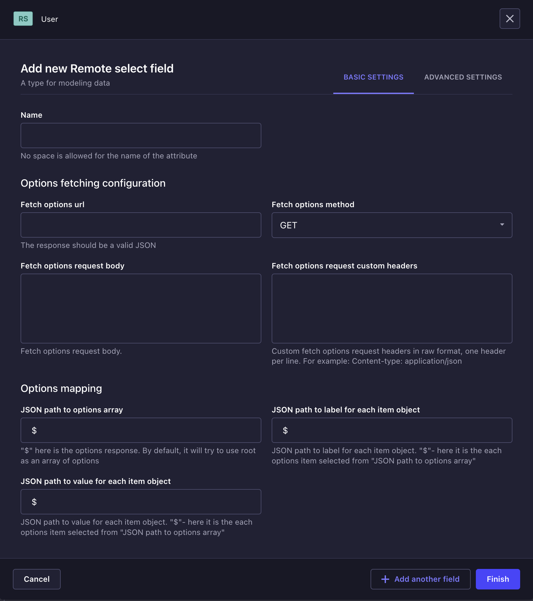
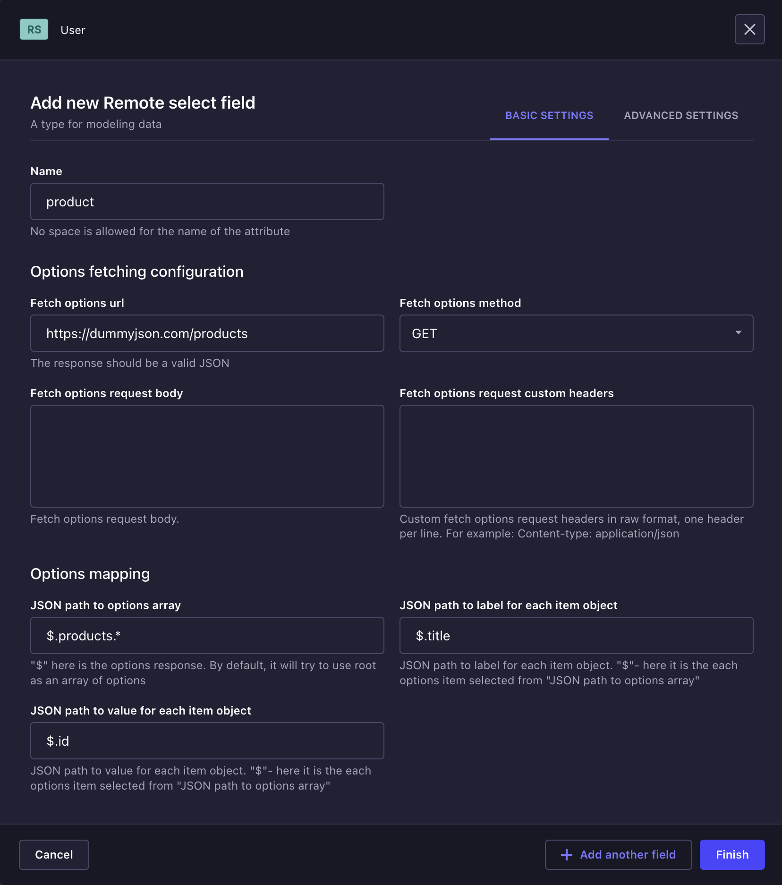
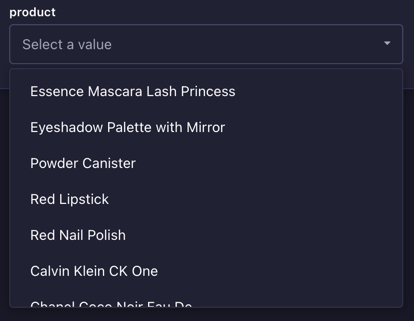
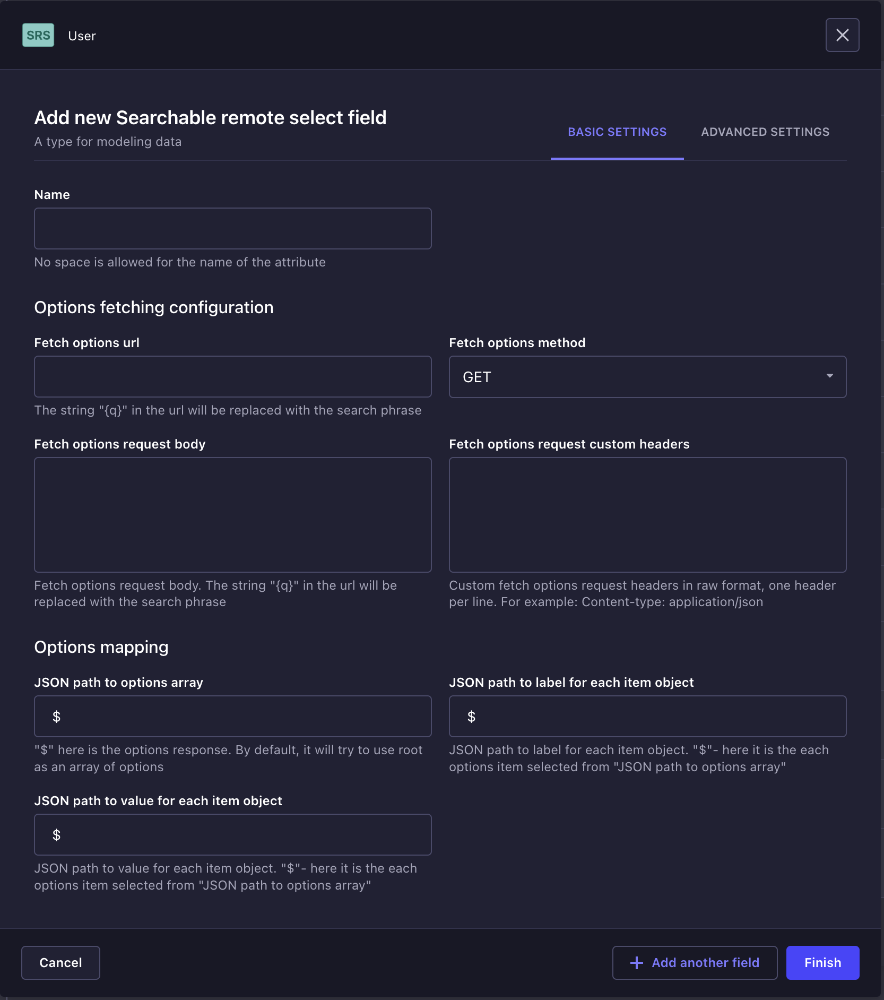
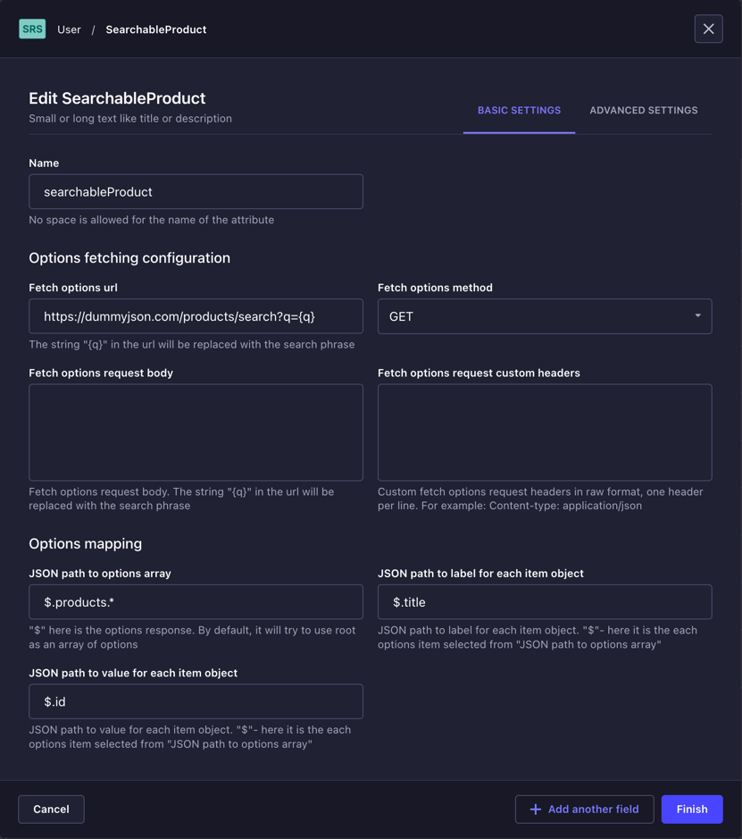
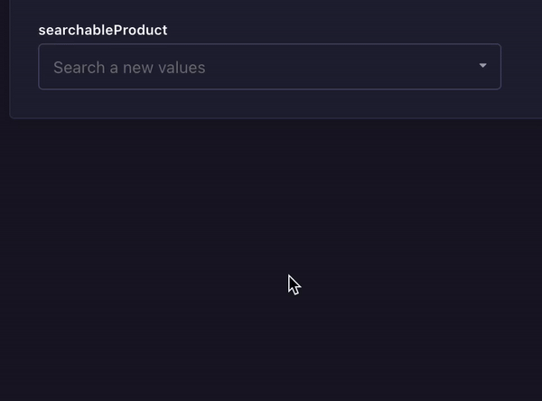
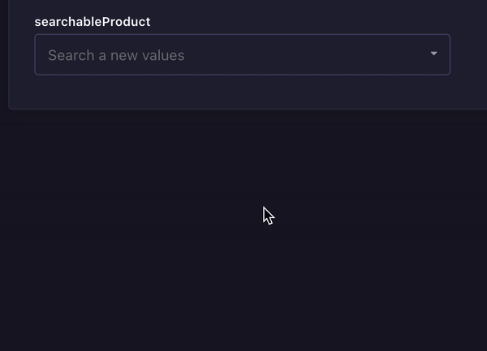

##

<p align="center">
  
</p>

A powerful tool that adds select type inputs to your strapi with the ability to dynamically load options via API.
Supports static and searchable endpoints—autocomplete.
This module adds two inputs:

**Remote select**, allow selecting one or several values from the remote options endpoint.
**Searchable select**, allow selecting one or several values from the searchable remote endpoint.

Features (all selects support remote options loading):

- plain select
- multi select
- searchable select, single model
- searchable select, multiple model

## 💭 Motivation

Too often I've had situations where I need to allow selecting one or more values from a list that is available as an API.
Simply transferring the value is not an option, as the values can change dynamically on the remote resource,
and the native Select has the same value as the one displayed to the user, which is not always convenient.
That's why I was inspired to create this module, which solves this problem, you just need to add the desired input and configure it and that's it, you will always get the latest options, and the ability to use the searchable API or auto-complete significantly expands the use cases for this module.


## ⚠️ Requirements

`"node": ">=18.0.0 <=20.x.x"`
`"@strapi/strapi": "^4.24.5"`

## ⏳ Installation
```bash
# using yarn
yarn add strapi-plugin-remote-select

# using npm
npm install strapi-plugin-remote-select --save
```

Enable plugin in your `config/plugins.js` file, just add:

```js
module.exports = {
  "remote-select": {
    enabled: true,
  },
};
```

## 🪄 Usage

Each input select that this plugin adds has a similar configuration:

### Basic settings

Module is using JSON path for allow configurable way to get an option array, label, and value for options objects. Learn more about [JSON path here](https://github.com/dchester/jsonpath)

| Field name                              | Type     | Description                                                                                                          |
| --------------------------------------- | -------- | -------------------------------------------------------------------------------------------------------------------- |
| Fetch options url                       | `string` | A url for fetch options for select. Endpoint should return a valid json string as response                           |
| Fetch options method                    | `string` | HTTP method for requesting options. Default: `GET`                                                                   |
| Fetch options request body              | `string` | HTTP body for requesting options. Provide a your custom body for options fetching.                                   |
| Fetch options request custom headers    | `string` | Custom fetch options request headers in raw format, one header per line. For example: Content-type: application/json |
| JSON path to options array              | `string` | `$` - here it is the body answer to the options request                                                              |
| JSON path to label for each item object | `string` | `$` - here it is the each options item selected from "JSON path to options array"                                    |
| JSON path to value for each item object | `string` | `$` - here it is the each options item selected from "JSON path to options array"                                    |

Advanced settings:

| Field name    | Type     | Description |
| ------------- | -------- | ----------- |
| Default value | `string` |             |
| Multi mode    | `string` |             |
| Private field | `string` |             |

### Remote select input

Depends on `multi` option you will have in the model a single string from selected `value` option or array of selected `value` string.

Basic configuration window:



for example, let's consider the next api endpoint 'https://dummyjson.com/products' with response structure:

```json
{
  "products": [
    {
      "id": 1,
      "title": "Essence Mascara Lash Princess",
      "description": "The Essence Mascara Lash Princess is a popular mascara known for its volumizing and lengthening effects. Achieve dramatic lashes with this long-lasting and cruelty-free formula.",
      "category": "beauty",
      "price": 9.99,
      "discountPercentage": 7.17,
      "rating": 4.94,
      "stock": 5
    },
    {
      "id": 2,
      "title": "Eyeshadow Palette with Mirror",
      "description": "The Eyeshadow Palette with Mirror offers a versatile range of eyeshadow shades for creating stunning eye looks. With a built-in mirror, it's convenient for on-the-go makeup application.",
      "category": "beauty",
      "price": 19.99,
      "discountPercentage": 5.5,
      "rating": 3.28,
      "stock": 44
    },
    ...
  ]
}
```

Configured remote select window will look like that:
_We are going to use `id` field from a product object as value and `title` field as label_



and as a result, we have: (single mode)



multiple mode:


### Searchable remote select input

Depends on `multi` option you will have in the model a JSON string with the object:

```json
{
  "label": "Label from option",
  "value": "Value from option"
}
```

or JSON string with the array of objects:

```json
[
  {
    "label": "Label from option",
    "value": "Value from option"
  },
  {
    "label": "Label from option",
    "value": "Value from option"
  }
]
```

Basic configuration window:
It's the same as in Remote select input:



for example, let's consider the next api endpoint with search ability 'https://dummyjson.com/products/search?q=searchphrase' with the same response structure like as in Remote select example.

Configured remote select window will look like that:



and as a result, we have: (single mode)



multiple mode:


